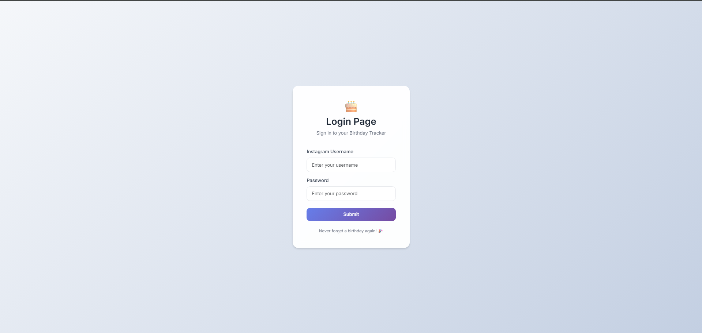
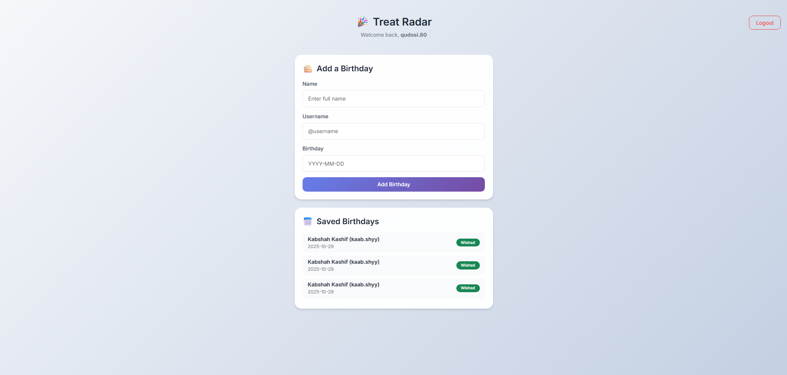

# 🎂 Party Radar

This Flask web app automatically sends **birthday wishes via Instagram Direct Message (DM)** to saved users at a scheduled time.  
It uses the **Instagrapi** library for Instagram automation and **APScheduler** for scheduling daily birthday checks.

---

##  Features

 User login using their Instagram credentials  
 Add friend birthdays  
 Automatically send DMs on their birthdays  
 Marks birthdays as “Wished” once message is sent  

---

## 🧩 Tech Stack

- **Flask** 
- **Flask-SQLAlchemy**  
- **Instagrapi**  
- **APScheduler** .  
-  **SQLite** 

# UI PREVIEW

